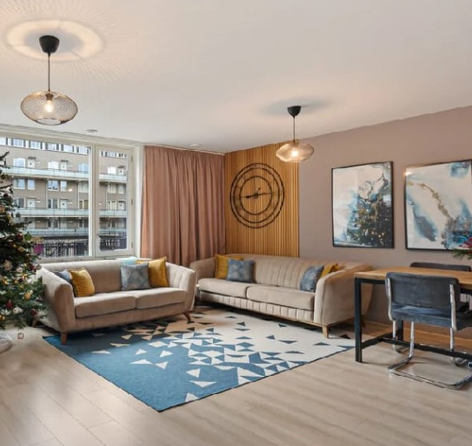
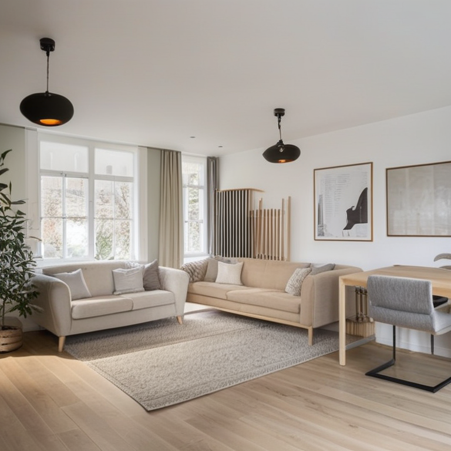
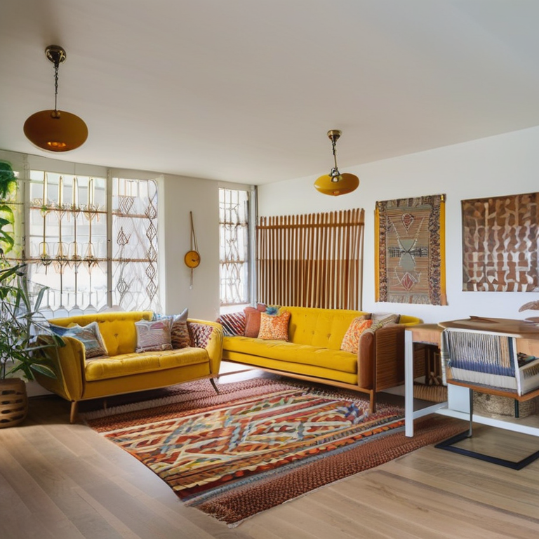
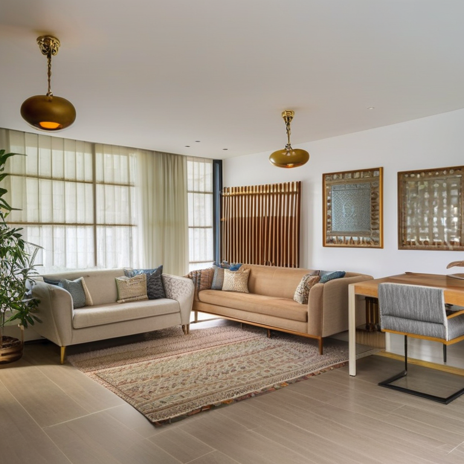
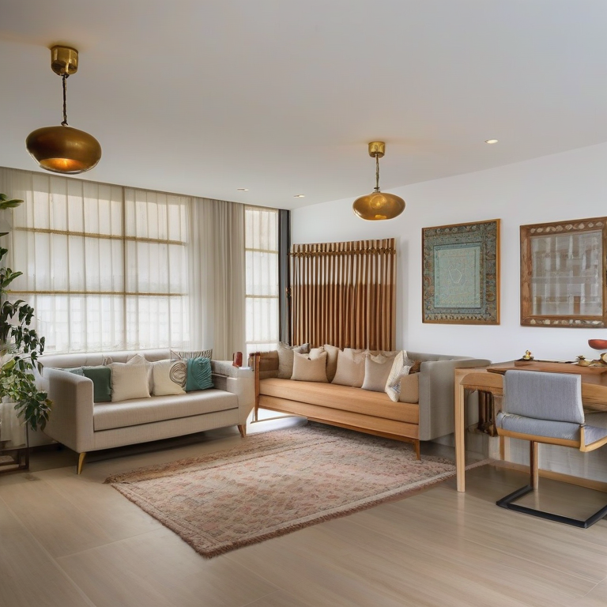

# HomeVision

AI interior redesign agent. Upload a room photo, describe your taste, and get photorealistic redesigns with matched IKEA product recommendations — all running locally on your GPU.

Built with: **LangGraph** · **SDXL + ControlNet** · **Depth-Anything v2** · **GPT-4o** · **FAISS** · **Gradio**

---

## Demo

A single agent session on one room photo — from upload to three redesigns to chat refinement.

**Input room**



**Scandinavian × Modern**



**Boho × Mid-Century Modern**



**Indian Contemporary**



**After chat refinement** — "make it warmer" (img2img, strength 0.55)



**Gradio UI**


> Total API cost for this run: **$0.14**. Generation (SDXL) runs fully locally on Apple MPS — no cloud GPU cost.

---

## What it does

1. **Analyses your room** — GPT-4o reads the photo and extracts room type, existing furniture, lighting, colour palette, and spatial constraints
2. **Estimates depth** — Depth-Anything v2 generates a depth map that ControlNet uses to preserve your room's spatial layout
3. **Suggests styles** — 27 curated styles, or blend two (e.g. *boho × scandinavian*)
4. **Generates redesigns** — SDXL + ControlNet depth-conditioned generation on your local GPU (Apple MPS or NVIDIA CUDA)
5. **Evaluates quality** — CLIP score + GPT-4o-as-judge rates layout preservation and style coherence
6. **Recommends products** — semantic search over 30,500 real IKEA products matched to the generated design
7. **Conversational refinement** — chat to iterate: "make it warmer", "add more plants", "remove the dining table"

---

## System requirements

Built and tested on **Apple Silicon (M5 Pro, 24 GB unified memory)** using PyTorch MPS.

- Python 3.10 – 3.12
- ~12 GB free storage (model weights + FAISS index)
- OpenAI API key (GPT-4o for room analysis and evaluation)

> Linux / NVIDIA CUDA and Windows are untested. The generation pipeline targets MPS — CUDA paths exist in PyTorch and diffusers but have not been validated.
> Generation takes ~6–10 min per image on M5 Pro.

---

## Quickstart

### 1. Clone and install

```bash
git clone https://github.com/preethai35-primary/HomeVision.git
cd HomeVision

python -m venv venv
source venv/bin/activate          # Windows: venv\Scripts\activate

pip install -r requirements.txt
```

### 2. Set your API key

```bash
cp .env.example .env
# open .env and add your OPENAI_API_KEY
```

GPT-4o is used for room analysis, style suggestion, and image evaluation.
Typical cost per full run: **$0.05 – $0.15**.

### 3. Download model weights (~10 GB, one-time)

```bash
python scripts/download_models.py
```

Downloads and caches in `~/.cache/huggingface/hub`:

| Model | Size | Purpose |
|---|---|---|
| `stabilityai/stable-diffusion-xl-base-1.0` | ~6.5 GB | Image generation |
| `diffusers/controlnet-depth-sdxl-1.0` | ~2.4 GB | Depth-conditioned generation |
| `madebyollin/sdxl-vae-fp16-fix` | ~160 MB | Sharper image decoding |
| `depth-anything/Depth-Anything-V2-Small-hf` | ~100 MB | Depth estimation |
| `ViT-B-32` (open_clip, openai) | ~350 MB | CLIP evaluation scoring |
| `all-MiniLM-L6-v2` (sentence-transformers) | ~90 MB | IKEA semantic search |

Re-running the app does not re-download — HuggingFace caches on first use.

### 4. Build the IKEA product index (~5 min, one-time)

Uses the [`jeffreyszhou/ikea-us-products-2025`](https://huggingface.co/datasets/jeffreyszhou/ikea-us-products-2025) dataset (30,500 products, MIT licence).

```bash
python rag/ikea_search.py --download   # ~200 MB from HuggingFace
python rag/ikea_search.py --build      # embeds + builds FAISS index (~5 min)
```

### 5. Launch the UI

```bash
python ui/gradio_app.py
# open http://localhost:7860
```

---

## Usage

1. **Upload** your room photo in the left panel
2. Set your **budget** (EUR range, e.g. `500-2000`) and **room type**
3. Click **Analyse Room** — GPT-4o reads your room, depth map is computed
4. Review the suggested **styles** and pick one (or blend two)
5. Click **Generate** — SDXL runs locally (~6–10 min on M5 Pro)
6. View the redesign, CLIP/layout scores, and IKEA recommendations
7. **Chat** to refine: type instructions like "make the walls warmer" or "add a floor lamp"

### Refinement tips

| Instruction type | Example | Strength used |
|---|---|---|
| Colour / mood | "make it warmer" | 0.40 — preserves layout |
| Add objects | "add more plants" | 0.55 — introduces new elements |
| Remove objects | "remove the dining table" | 0.65 — structural change |

> Removals are best-effort — the depth map anchors the original geometry.
> For reliable object removal, use one instruction per message.

---

## Available styles (27)

| Category | Styles |
|---|---|
| Nordic / East Asian | scandinavian, japandi, minimalist, wabi-sabi, zen japanese |
| Mediterranean | mediterranean, italian rustic, spanish colonial, portuguese, greek island, tuscan farmhouse |
| South / Southeast Asian | indian vintage, indian contemporary, moroccan riad, persian traditional, balinese tropical |
| Western Modern | mid-century modern, industrial, art deco, contemporary, luxury modern, coastal |
| Eclectic / Organic | boho, cottagecore, maximalist, farmhouse, french country |

You can also type a **custom style** in the UI text box, or blend two suggested styles.

---

## Project structure

```
homevision-v3/
├── ui/
│   └── gradio_app.py          ← Gradio 6 UI (main entry point)
│
├── agent/
│   ├── graph.py               ← LangGraph StateGraph
│   ├── state.py               ← HomeVisionState TypedDict
│   └── tools.py               ← all agent nodes
│
├── generation/
│   ├── local_pipeline.py      ← SDXL + ControlNet (MPS / CUDA)
│   └── prompt_builder.py      ← prompt builder (27 styles + blending)
│
├── vision/
│   ├── room_analyzer.py       ← GPT-4o room analysis
│   └── depth_estimator.py     ← Depth-Anything v2
│
├── rag/
│   ├── ikea_search.py         ← IKEA semantic search (30.5k products)
│   └── image_retriever.py     ← CLIP + FAISS style reference retrieval
│
├── evaluation/
│   └── evaluator.py           ← CLIP scoring + GPT-4o-as-judge
│
├── lora/
│   └── trainer.py             ← LoRA fine-tuning (in progress)
│
├── scripts/
│   └── download_models.py     ← one-shot model weight downloader
│
├── data/                      ← gitignored — generated locally
│   ├── outputs/               ← generated images
│   ├── ikea_products.csv      ← downloaded by setup script
│   └── *.faiss                ← built by setup script
│
├── .env.example               ← copy to .env, add your key
└── requirements.txt
```

---

## Architecture

```
photo + budget
      │
      ▼
 validate_input
      │
      ▼
 analyze_room  ──────── GPT-4o vision (room type, furniture, palette)
      │
      ▼
 compute_depth_map ───── Depth-Anything v2 (local, ~10s)
      │
      ▼
 suggest_styles ─────── GPT-4o (3 style suggestions)
      │
      ▼
 retrieve_examples ───── CLIP + FAISS (visual style references)
      │
      ▼
 select_styles ◄──────── user picks / blends styles
      │
      ▼
 search_products ──────── sentence-transformers + FAISS (30.5k IKEA)
      │
      ▼
 generate_images ──────── SDXL + ControlNet depth (~6–10 min)
      │
      ▼
 evaluate_results ─────── CLIP score + GPT-4o-as-judge
      │                    retry if scores are poor (max 2x)
      ▼
 present_results
      │
      ▼
 classify_intent ◄──────── user chat message
   /    |    \
refine  info  done
  │      │
  │   handle_info ─── GPT-4o answers product/style questions
  │      │
  ▼      ▼
 refine_image ─────── SDXL img2img (strength 0.40–0.65)
      │
      ▼
 evaluate_results → loop
```

---

## Cost breakdown

| Operation | Model | Approx cost |
|---|---|---|
| Room analysis | GPT-4o | $0.04 |
| Style suggestions | GPT-4o | $0.01 |
| Image evaluation | GPT-4o | $0.04 |
| Chat / info answers | GPT-4o-mini | < $0.01 |
| Intent classification | GPT-4o-mini | < $0.01 |
| **Total per full run** | | **$0.05 – $0.15** |

Generation (SDXL) and search (FAISS + CLIP) are fully local — no API cost.

---

## Planned / future work

- **Inpainting** — mask-based object removal/insertion for precise structural edits
- **IP-Adapter** — feed the style reference image directly into the UNet for stronger style transfer
- **LoRA fine-tuning** — style-specific LoRA adapters for Indian vintage, Moroccan, Balinese (SDXL base struggles with these)
- **Docker (CUDA)** — Linux GPU deployment via docker-compose with HuggingFace cache volume mount
- **Cloud deployment** — HuggingFace Spaces or RunPod for GPU-as-a-service

---

## Troubleshooting

**Segfault on macOS when loading IKEA index**
Set these env vars before running (already handled in `ui/gradio_app.py`):
```bash
OMP_NUM_THREADS=1 TOKENIZERS_PARALLELISM=false python ui/gradio_app.py
```

**"IKEA index not built"**
Run the two build commands in step 4 above.

**Generation is slow**
Expected — SDXL takes 6–10 min per image on M5 Pro with 30 denoising steps.
Reduce steps in `generation/local_pipeline.py` (`num_inference_steps=20`) for faster but lower-quality output.

**Out of memory (MPS)**
Close other GPU-heavy apps. The pipeline loads ~5 GB of model weights.
If it still OOMs, run `pipe.unload()` manually and restart.

**CLIP truncation warning**
Prompts over 77 tokens are silently truncated by SDXL's text encoder.
The project handles this by shortening quality tokens and prepending refinement instructions. If you see truncation warnings for style prompts, the style vocabulary is too long — shorten `materials` in `generation/prompt_builder.py`.
